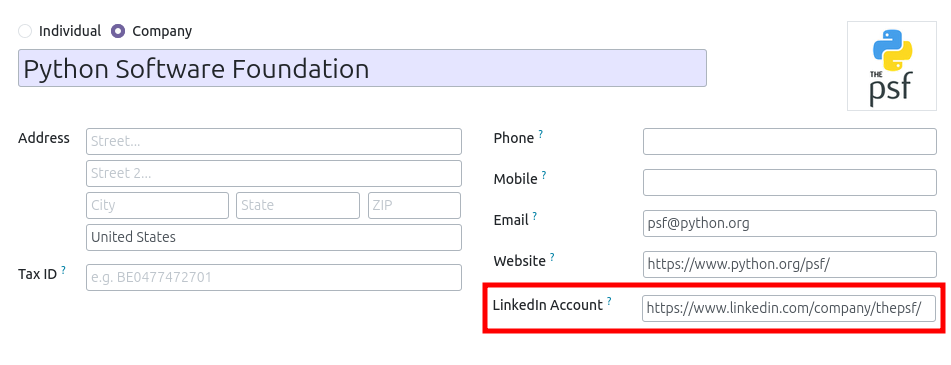
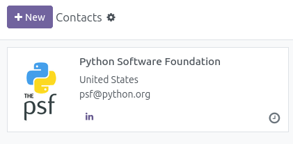
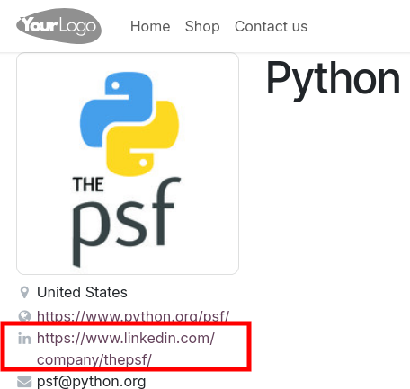

This module adds a new "LinkedIn Account" field, at partner level.

A new icon is available in the kanban view

If the partner is displayed on the website, the new URL is displayed.

LinkedIn is a US centralized social network developped under proprietary licence.
The platform requires users to create an account in order
to view other people's information.

More information at <https://en.wikipedia.org/wiki/LinkedIn>.
