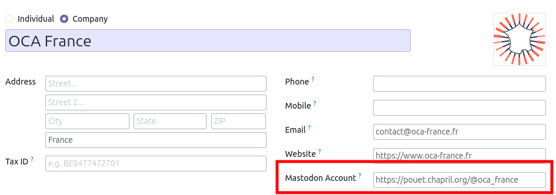
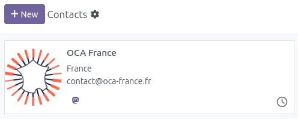
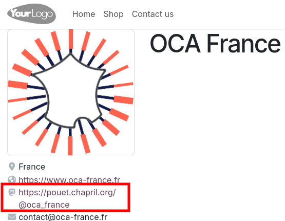

This module adds a new "Mastodon Account" field, at company level.

A new icon is available in the kanban view

If the partner is displayed on the website, the new URL is displayed.

Mastodon is a decentralized social network developed in Open Source.
More information at <https://joinmastodon.org/>.
